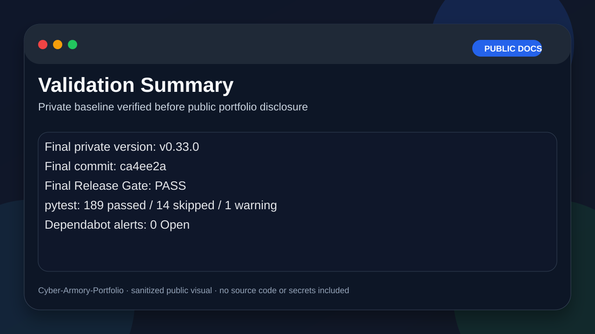
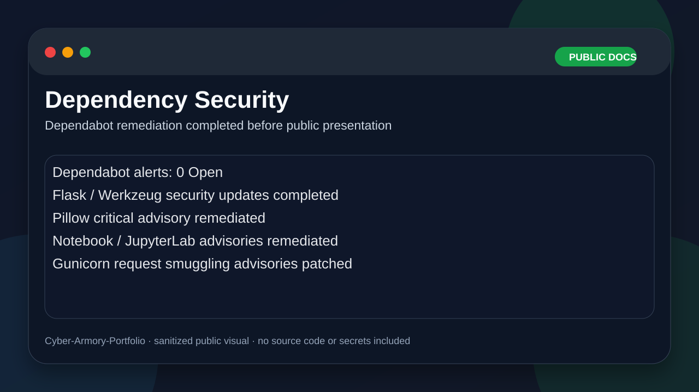
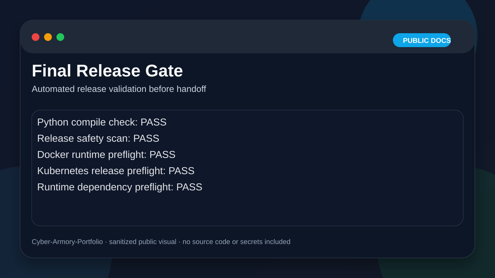
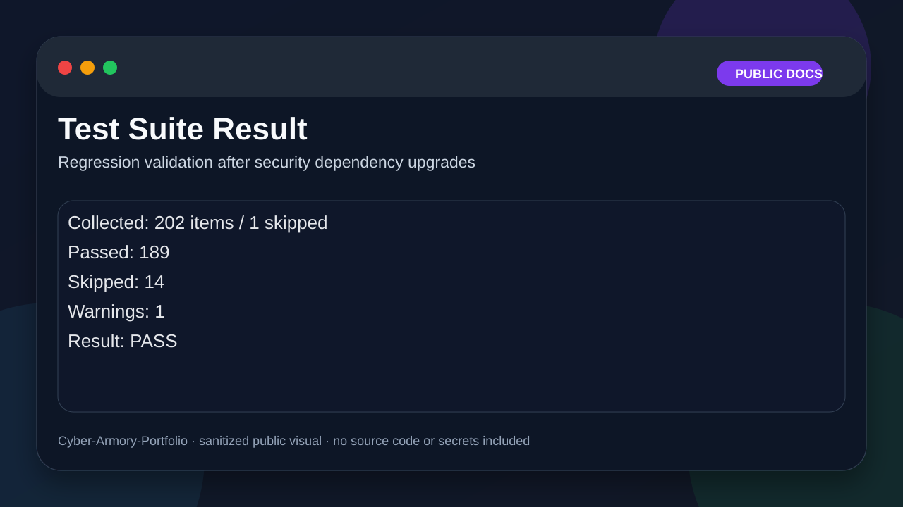
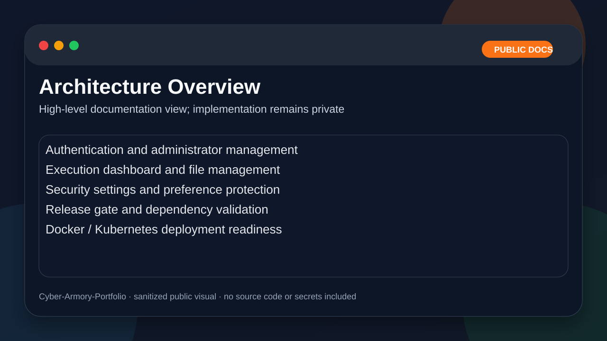

# Cyber Armory Portfolio

> Documentation-only public portfolio for a private security operations platform prototype.  
> The implementation repository is intentionally private because the project may be commercialized later.

## Overview

Cyber Armory is a private Flask-based security operations platform prototype focused on disciplined security engineering, release validation, and operational readiness.

The private implementation includes:

- authentication and administrator management
- execution dashboard
- file management
- security hardening
- release safety gate
- dependency vulnerability remediation
- Docker/Kubernetes deployment readiness
- operational runbooks and validation workflows

This public repository contains **documentation only**.  
It does not include source code, internal execution logic, deployment secrets, or production infrastructure details.

## Final Private Baseline

| Item | Result |
|---|---|
| Private implementation repository | `Cyber-Armory` |
| Public portfolio repository | `Cyber-Armory-Portfolio` |
| Final private version | `v0.33.0` |
| Final private commit | `ca4ee2a` |
| Final Release Gate | PASS |
| Test result | 189 passed / 14 skipped / 1 warning |
| Dependabot alerts | 0 Open |
| Default branch | main |
| Runtime artifacts | Excluded |
| Public source disclosure | No source code included |

## Security Work Completed

- Removed runtime artifacts from the release tree
- Excluded local data, logs, uploads, database files, backup files, and virtual environments
- Patched vulnerable dependencies reported by Dependabot
- Added top-level dependency security floors for Dependabot visibility
- Patched Gunicorn request smuggling advisories
- Validated release using an automated final release gate
- Verified the test suite after dependency upgrades
- Kept the implementation repository private to preserve future commercialization options

## Architecture Summary

| Area | Description |
|---|---|
| Authentication | Login, password policy, session handling, and 2FA-related hardening |
| Admin Management | User and role management |
| Execution Dashboard | Controlled operational workflow interface |
| File Management | Upload, listing, and validation workflows |
| Security Settings | API key, 2FA, password policy, and preference security |
| Release Gate | Automated checks for release safety |
| Deployment Readiness | Docker and Kubernetes preflight validation |
| Documentation | Runbooks, checklists, release notes, and handoff materials |

## Disclosure Boundary

This public repository intentionally excludes:

- full source code
- real deployment configuration
- `.env` files
- credentials, tokens, API keys, or passwords
- internal execution logic
- production infrastructure details
- exploit implementation details
- runtime data, logs, uploads, and backups

## Visual Portfolio

These visuals are sanitized public mockups. They summarize validation and architecture outcomes without exposing private source code or operational details.

| Validation | Dependency Security |
|---|---|
|  |  |

| Release Gate | Test Result |
|---|---|
|  |  |

| Architecture Overview |
|---|
|  |

## Suggested Screenshots

Screenshots may be added later after sanitization:

- dashboard overview
- user/admin management page
- Final Release Gate PASS terminal output
- pytest result
- Dependabot 0 Open screen

Before publishing screenshots, remove or blur:

- usernames and emails
- internal IP addresses
- private domains
- file paths that reveal personal information
- tokens, API keys, session values, and secrets

## Intended Use

This project is intended for authorized security testing, training, and defensive security operations only.

Do not use security tools or related techniques against systems you do not own or do not have explicit permission to test.

## Why the Source Code Is Private

The implementation may become a commercial product.  
Keeping the source private protects:

- product architecture
- execution workflow design
- security hardening implementation
- deployment strategy
- future commercialization options

This portfolio repository demonstrates the engineering process and validation discipline without exposing the implementation.

